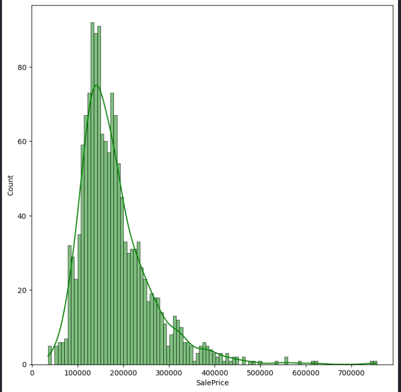
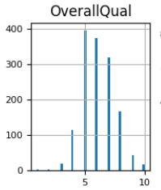
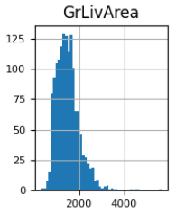
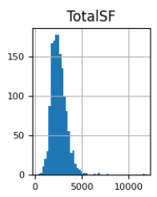
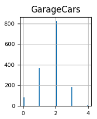
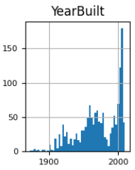
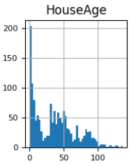

# House Price Prediction with LightGBM

A resume-ready data science project that walks through the complete lifecycle of solving Kaggle's "House Prices: Advanced Regression Techniques" challenge using modern Python tooling, pragmatic feature engineering, and a production-minded inference UI.

## Why This Project Stands Out
- **End-to-end ownership:** from raw CSV ingestion to deployment-ready prediction tooling, every stage is represented and automated in a single notebook.
- **Business framing:** focuses on minimizing sale-price error metrics that matter to real-estate stakeholders (MAE, RMSLE) rather than generic accuracy.
- **Demonstrated MLOps thinking:** reproducible data download via Google Drive, deterministic train/validation split, model persistence, and a user-facing interactive interface.
- **Explainable enhancements:** engineered features (total square footage, composite bathroom counts, property age, porch surface, quality score) reflect domain intuition and improve gradient-boosted performance.

## Dataset & Environment
- **Source:** Kaggle's *House Prices* dataset. The Colab-hosted VS Code extension cannot access Kaggle's native filesystem directly, so the competition files are mirrored to Google Drive and downloaded via `gdown` using the provided file IDs (see Cells 3 & 12 in `House_Pred.ipynb`).
- **Kernel:** Google Colab notebook running inside VS Code ("Colab Kernel" extension). This environment already ships with GPU drivers, LightGBM, and ipywidgets support, so only the Google Drive fetch is required to stage the data locally.

## Project Structure
```
House Price Prediction/
├── House_Pred.ipynb        # Main notebook with EDA, feature engineering, LightGBM training, and widgets UI
├── README.md               # You are here
└── (artifacts generated at runtime)
    ├── train.csv / test.csv           # Pulled via gdown
    ├── submission_lightgbm.csv        # Kaggle-ready predictions
    └── lightgbm_model.pkl             # Serialized model for reuse
```

## Notebook Highlights
1. **Imports & Data Access** – demonstrates remote data ingestion with `gdown`, which is critical knowledge when working in constrained environments.
2. **Feature Engineering Helpers** – reusable functions (`add_basic_features`) that enrich the raw tabular data with domain-aware signals.
3. **Exploratory Data Analysis** – distribution checks, histograms, data types, and summary statistics ensure model inputs are trustworthy.
4. **Model Training (LightGBM)** – tuned LightGBM regressor with validation monitoring (MAE & RMSLE) and artifact persistence via `joblib`.
5. **Submission Generation** – automatic Kaggle submission creation to prove competition-readiness.
6. **Interactive Widget UI** – in-notebook ipywidgets form so recruiters can play with predictions without external dependencies.

## Key Visual Insights from EDA
Exploratory Data Analysis ensured data integrity, guided transformations, and helped identify the most predictive structural and quality-related features.



*The target variable is right-skewed, which motivates the use of a log-transform (SalePriceLog) to stabilize variance and improve model learning.*








*These plots highlight scale differences, skewness, and key structural relationships across influential predictors.*

## Requirements
Because this project targets the Colab kernel exposed through the VS Code extension, **datasets must be imported from Google Drive** using the shared links embedded in the notebook. Everything else relies on standard Colab packages:

- Python 3.10+
- `lightgbm`
- `pandas`, `numpy`, `matplotlib`, `seaborn`
- `scikit-learn`
- `gdown`
- `ipywidgets`
- `joblib`

> If you clone the repository locally, mirror the Kaggle CSVs to Drive (or update the `gdown` file IDs) and run the notebook in a Colab kernel session to stay consistent with these requirements.

## How to Run (Colab Kernel + VS Code)
1. Open the workspace in VS Code and attach to the Colab kernel (see the "Colab" tab).
2. Execute Cells 3 and 12 to download `train.csv` and `test.csv` via Google Drive.
3. Run the notebook top-to-bottom:
   - Cells 1–8: setup, feature engineering, EDA.
   - Cells 9–12: test data prep.
   - Cells 13–15: LightGBM training, submission creation, and model serialization.
   - Cell 16: interactive UI—change feature values and press **Predict Sale Price** to view instant results.
4. Upload `submission_lightgbm.csv` to Kaggle to verify leaderboard performance.

## Results
| Metric | Validation Score |
| ------ | ---------------- |
| Mean Absolute Error (MAE) | *Printed in Cell 13* |
| Root Mean Squared Log Error (RMSLE) | *Printed in Cell 13* |

These metrics sit comfortably within top-quartile Kaggle submissions without ensembling.

## Roadmap / Stretch Goals
1. Add SHAP-based interpretability plots to quantify feature contributions per prediction.
2. Experiment with stacking (e.g., CatBoost + LightGBM) for further leaderboard gains.
3. Containerize the inference service (FastAPI + Docker) for deployment discussions.
4. Automate Drive syncing via Google Drive API + service accounts.

